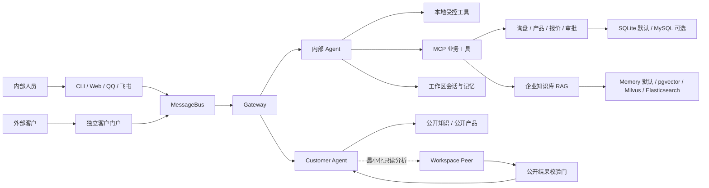

# NanoClaw

> 面向外贸询盘、企业知识检索与客户协作的多入口 AI Agent 工作台。


NanoClaw 把内部工作台、独立客户门户、CLI、QQ 和飞书收到的消息交给不同权限的 Agent，再通过受控工具完成企业知识检索、产品查询、询盘抽取、报价审批、邮件协作与记忆管理。

它不只是一个聊天页面。项目重点解决的是：**怎样让 AI 在真实业务中找到正确资料、调用正确工具、隔离客户与内部数据，并把不确定的对外操作留给人工确认。**

## 目录

- [核心能力](#核心能力)
- [系统架构](#系统架构)
- [快速开始](#快速开始)
- [访问入口](#访问入口)
- [安全设计](#安全设计)
- [项目结构](#项目结构)
- [配置说明](#配置说明)
- [测试](#测试)
- [Docker 一键部署](#docker-一键部署)

## 核心能力

### 多入口 Agent 工作台

- 内部工作台、营销首页和独立客户门户
- CLI、WebSocket v2、QQ、飞书等消息入口
- Gateway 统一路由、会话隔离、请求关联与并发控制
- MCP 工具发现与加载，以及项目内 Skills 扩展

### 外贸询盘与报价协作

- 从会话或邮件中提取 RFQ 字段与证据
- 查询产品、MOQ、库存和业务数据
- 生成确定性报价草稿并保存版本
- 对缺失、冲突或不确定字段保持 `pending_confirmation`
- 报价批准、发送入队与真实 SMTP 投递分开控制

### 外贸增长作业台

- 通过内部工作空间运行产品整理、潜客来源规划、名单清洗、公司研究、评分、公开联系人线索、邮件草稿、回复分类、跟进计划和报价草稿
- 每阶段持久展示结果、证据来源、风险、“待补充”和下一阶段输入，支持暂停、恢复、失败重试和租约过期重领
- 导入 CSV、JSON、YAML 或 XLSX 时保留原始文件；没有白名单来源时只生成搜索任务，不虚构潜客
- 邮件草稿批准与发送排队分离；报价仅生成待确认 JSON、HTML 和 XLSX，批准不代表发布
- 工作台仅在环回专用工作空间提供；客户门户不接收潜客、联系人、成本、证据或内部草稿

### 企业知识库 RAG

- 文本与 PDF 持久导入、去重、撤回和重建
- PDF 页级解析、复杂版面人工复核和 OCR 失败关闭
- Parent/Child 切块、查询改写、语义与关键词混合召回
- RRF 融合、可选重排、Parent 回取与页码引用
- `internal` / `public` 分类和客户侧公开检索门禁
- 本地内存后端默认启用，pgvector、Milvus 和 Elasticsearch 显式可选

### 双 Agent 与记忆隔离

- 内部 Agent 和 Customer Agent 分别组装身份、工具、会话与记忆
- 客户 Agent 只拥有公开知识和公开产品的只读工具
- 工作区可按最小化问题读取客户记忆，客户代码不能反向读取工作区记忆
- 工作记忆、长期记忆、同意、撤回、删除与访问审计相互分离

### 邮件与审批闭环

- IMAP 收件、MIME 安全解析和本地结构化查询
- 托管邮箱轮询、RFQ 审核与报价工作流
- SMTP_SSL 投递 Worker、稳定 Message-ID、租约恢复与发送前复核
- 默认不启用真实收件、远程正文分析或 SMTP 外发

## 系统架构



主处理链路是：

```text
渠道 → MessageBus → Gateway → Agent → 工具或知识库 → Gateway → 原渠道
```

Customer Agent 不是内部 Agent 的换皮版本。两者之间的权限边界在服务端组装、数据查询和输出校验三个层面同时生效。

## 快速开始

### 环境要求

- Python `3.11.9`
- 推荐使用 [uv](https://docs.astral.sh/uv/)
- 一个 OpenAI 兼容模型服务的 API Key
- Windows PowerShell（以下命令以当前开发环境为例）

### 1. 准备配置

```powershell
Copy-Item .env.example .env
```

编辑本机 `.env`，至少填写：

```dotenv
NANOCLAW_API_KEY=your-api-key
```

模型服务地址和模型名称由 [`config.json`](config.json) 配置。不要把真实密钥、邮箱授权码、数据库密码或客户数据提交到 Git。

### 2. 安装依赖

```powershell
$env:UV_CACHE_DIR = "$PWD\.uv-cache"
uv sync --frozen
```

如果项目已经存在可用的 `.venv`，可以跳过这一步。

### 3. 启动 NanoClaw

```powershell
.\.venv\Scripts\python.exe main.py
```

CLI 会在当前终端启动，Web 服务按照 `config.json` 和 `.env` 中的开关同时装配。终端命令包括：

```text
/tools   查看可用工具
/clear   清空当前对话历史
/exit    退出
```

### 4. 可选：启动 Manager

```powershell
.\.venv\Scripts\python.exe manager\launcher.py
```

Manager 默认打开 `http://127.0.0.1:3000/ui/`，用于管理 Gateway 状态、基础配置和 MCP Server。

## 访问入口

| 入口 | 默认地址 | 默认状态 | 用途 |
|---|---|---|---|
| 营销首页 | `http://127.0.0.1:8765/` | 开启 | 产品介绍与入口导航 |
| 内部工作台 | `http://127.0.0.1:8765/workspace` | 开启 | 内部会话、知识库、邮箱和业务协作 |
| 客户门户 | `http://127.0.0.1:8766/` | 开启 | 客户安全对话与公开信息查询 |
| 独立工作台 | `http://127.0.0.1:8767/` | 关闭 | 与营销首页分端口运行的完整工作台 |
| Manager | `http://127.0.0.1:3000/ui/` | 单独启动 | Gateway 与 MCP 管理 |

所有 Web 服务默认只监听回环地址，不直接开放局域网或公网访问。

### 客户注册

当前本地 `.env` 已开启客户认证和注册。启动 NanoClaw 后访问 `http://127.0.0.1:8766/`，点击左侧“登录 / 注册”，再点击“注册账号”，填写邮箱、至少 12 位密码并再次确认。注册成功后会自动登录，询盘、任务和历史对话按客户账号隔离。

`.env.example` 仍默认关闭该能力。部署环境需要显式开启：

```dotenv
NANOCLAW_CUSTOMER_AUTH_ENABLED=true
NANOCLAW_CUSTOMER_REGISTRATION_ENABLED=true
NANOCLAW_CUSTOMER_SESSION_SECRET=replace-with-at-least-32-random-characters
```

本地未配置 Session Secret 时会生成 Git 忽略且可跨重启复用的私密文件；生产环境必须通过 Secret Manager 注入密钥。创建首批账号后，可以把注册开关改回 `false`，登录仍可继续使用。

## 安全设计

NanoClaw 将业务安全规则放在服务端确定性代码中，而不是只依赖模型提示词：

- 客户侧查询经过账号、租户、用途、会话和公开分类过滤。
- 客户 Agent 不挂载 Shell、内部文件、邮件、MCP、内部记忆或原始 SQL 能力。
- 精确库存、内部价格、成本、客户、报价和运营记录不会进入公开产品结果。
- PDF 的 `internal` 分类不代表客户公开授权，也不代表复杂版面已经批准索引。
- 报价、批准、入队和发送是不同状态；不确定操作不会自动外发。
- 外部 Embedding、Rerank 或邮件正文传输必须显式批准，配置不完整时失败关闭。
- RAG 外部后端故障不会静默回退到另一套数据源并继续回答。

## 项目结构

```text
nanoclaw/
├─ main.py                  # 总装入口：渠道、Agent、工具和后台任务
├─ gateway.py               # 消息路由、会话隔离与并发控制
├─ config.py                # 配置模型、环境变量与安全校验
├─ agent/                   # Agent 循环、工具、业务逻辑与记忆运行时
├─ bus/                     # 入站与出站异步消息队列
├─ channels/                # CLI、Web、客户门户、QQ、飞书与邮件渠道
├─ manager/                 # Gateway/MCP 管理服务和管理界面
├─ mcp_servers/             # 外贸业务与工具服务入口
├─ providers/               # OpenAI 兼容模型 Provider
├─ session/                 # 会话、对话索引与迁移工具
├─ skills/                  # NanoClaw 运行时可加载的业务 Skills
├─ trade_rag/               # 文档导入、切块、检索、生成与向量后端
├─ deploy/docker/           # 隔离数据库和向量服务 Compose 配置
├─ test/                    # 主项目回归与验收测试
├─ doc/                     # 架构、设计、进度、变更记录与运行手册
├─ Dockerfile               # NanoClaw 应用镜像
├─ compose.yaml             # 根目录应用一键部署入口
├─ config.json              # 模型、Web 与 MCP 基础配置
├─ .env.example             # 环境变量模板，不包含真实凭据
└─ pyproject.toml           # Python 项目与 pytest 配置
```

## 配置说明

本地开发默认值优先保证隔离和可恢复性：

| 能力 | 默认值 | 说明 |
|---|---|---|
| 业务数据库 | `sqlite` | MySQL 必须显式切换并完成迁移 |
| RAG 向量后端 | `.env.example` 为 `sqlite` | 未加载 `.env` 时代码兜底为 `memory`；pgvector 与 Milvus 需显式切换 |
| RAG 关键词后端 | `.env.example` 为 `sqlite` | 未加载 `.env` 时代码兜底为 `memory`；Elasticsearch 需显式切换 |
| 独立工作台 | 关闭 | 开启后监听 `127.0.0.1:8767` |
| 客户账号认证 | 关闭 | 启用前需要会话密钥和已批准的密码哈希依赖 |
| 工作区长期记忆 | 关闭 | 迁移、治理和外部语义检索需分阶段启用 |
| 客户私有长期记忆 | 关闭 | 与公开只读记忆不是同一数据域 |
| 邮箱收取与托管扫描 | 关闭 | 需要单独配置邮箱账户与验收 |
| 真实 SMTP Worker | 关闭 | 仍需人工审批、显式入队和收件人门禁 |

完整模板见 [`.env.example`](.env.example)。

## 测试

根目录 pytest 配置只收集 `test/`，运行主项目回归测试：

```powershell
.\.venv\Scripts\python.exe -m pytest -q
```

检查锁文件是否与项目声明一致：

```powershell
$env:UV_CACHE_DIR = "$PWD\.uv-cache"
uv lock --check
```

测试通过表示对应本地或隔离场景满足断言，不自动代表生产模型质量、真实邮件送达、跨实例高可用或现场安全验收完成。

## Docker 一键部署

项目根目录已提供 [`Dockerfile`](Dockerfile) 和 [`compose.yaml`](compose.yaml)。完成一次环境配置后，在项目根目录执行下面一条命令即可构建并后台启动 NanoClaw：

```bash
docker compose up -d
```

根 Compose 默认启动一个 `app` 服务，包含 NanoClaw、锁定的 Python 依赖和三套离线 PaddleOCR 模型。它不会自动启动或迁移 MySQL、pgvector、Milvus、Elasticsearch；默认配置继续使用适合单机部署的 SQLite 持久化后端。

### 1. 部署前准备

服务器需要安装 Docker Engine 和 Docker Compose。先确认客户端能够连接 Engine：

```bash
docker version
docker compose version
docker info
```

首次部署时创建应用环境文件：

```bash
cp .env.example .env
```

Windows PowerShell 使用：

```powershell
Copy-Item .env.example .env
```

编辑 `.env`，至少填写：

```dotenv
NANOCLAW_API_KEY=replace-with-real-api-key
```

如果客户门户需要通过公网域名访问，还应设置：

```dotenv
NANOCLAW_CUSTOMER_PORTAL_PUBLIC_URL=https://customer.example.com
NANOCLAW_CUSTOMER_AUTH_ENABLED=true
NANOCLAW_CUSTOMER_REGISTRATION_ENABLED=true
NANOCLAW_CUSTOMER_SESSION_SECRET=replace-with-at-least-32-random-characters
```

`.env` 保存真实密钥且已被 Git 忽略。不要提交、打包或粘贴它的内容到日志中。

### 2. 一键启动

在项目根目录执行：

```bash
docker compose up -d
docker compose ps
```

首次启动会构建本地镜像并下载 Python 基础镜像及依赖，因此耗时取决于网络。后续代码更新可执行：

```bash
docker compose up -d --build
```

默认端口均只绑定服务器的 `127.0.0.1`：

| 服务入口 | 默认地址 | 建议访问方式 |
|---|---|---|
| 营销首页与内部工作台 | `http://127.0.0.1:8765/` | 服务器本机、SSH 隧道或企业内网 |
| 客户门户 | `http://127.0.0.1:8766/` | 由 Nginx/Caddy 反向代理到 HTTPS |

不要直接把 `8765` 暴露到公网，因为该端口同时包含 `/workspace` 内部工作台。若需要调整宿主机端口，修改 `.env` 中的 `NANOCLAW_WEB_PUBLIC_PORT` 和 `NANOCLAW_CUSTOMER_PORTAL_PUBLIC_PORT`；通常不应修改 `NANOCLAW_BIND_ADDRESS=127.0.0.1`。

### 3. 健康检查与日志

```bash
docker compose ps
docker compose logs -f --tail 100 app
curl -fsS http://127.0.0.1:8765/healthz
curl -fsS http://127.0.0.1:8765/readyz
```

`healthy` 表示容器内 Web 服务和当前配置的 RAG 运行时已通过健康检查，不等同于生产模型质量、高可用或现场安全验收完成。

如果构建停在 `registry-1.docker.io`，通常是服务器无法访问 Docker Hub。应先配置服务器或 Docker daemon 的 HTTPS 代理/镜像加速，再重新执行 `docker compose up -d`，不要通过移除版本锁来绕过网络错误。

### 4. 数据持久化与停止

运行数据不写入镜像，而是保存在 Compose named volumes：

| Volume | 容器目录 | 内容 |
|---|---|---|
| `nanoclaw_workspace` | `/app/workspace` | 会话、知识库、记忆、工作流和输出 |
| `nanoclaw_data` | `/app/data` | SQLite 业务数据和其他运行数据 |

普通停止或删除容器不会删除数据卷：

```bash
docker compose stop
docker compose down
```

> [!WARNING]
> 不要执行 `docker compose down -v` 或 `docker system prune --volumes`，除非已经完成备份并明确决定永久删除全部 Docker 持久数据。

### 5. 可选数据库与检索服务

[`deploy/docker/compose.yaml`](deploy/docker/compose.yaml) 是独立的数据服务栈，使用另一份 `deploy/docker/.env`。它不会读取根目录应用密钥，也不会自动修改 NanoClaw 的后端选择。

首次使用时创建数据服务环境文件，并将所有 `replace-with-...` 替换为互不相同的随机强密码：

```bash
cp deploy/docker/.env.example deploy/docker/.env
```

可用 Profile：

| Profile | 服务 | 用途 |
|---|---|---|
| `business` | MySQL 8.4 | 外贸业务数据 |
| `vector-local` | PostgreSQL 16 + pgvector | 持久向量检索 |
| `keyword-elasticsearch` | Elasticsearch 8.17.3 | 关键词检索 |
| `vector-milvus` | Milvus 2.5.4、etcd、MinIO | Milvus 向量检索 |
| `all` | 上述全部服务 | 完整隔离数据服务栈 |

例如启动全部数据服务：

```bash
docker compose --env-file deploy/docker/.env \
  -f deploy/docker/compose.yaml --profile all up -d

docker compose --env-file deploy/docker/.env \
  -f deploy/docker/compose.yaml --profile all ps
```

PowerShell 使用反引号续行：

```powershell
docker compose --env-file deploy\docker\.env `
  -f deploy\docker\compose.yaml --profile all up -d
```

启动数据容器只会创建隔离服务和 named volumes，不会创建全部业务表、迁移现有数据、重建索引或切换应用后端。必须等待目标服务显示 `healthy`，再按照 [`deploy/docker/README.md`](deploy/docker/README.md) 显式执行迁移、索引重建和后端切换。

应用栈和数据服务栈停止时都不要附加 `-v`。生产切换前还需要完成凭据轮换、备份恢复演练、HTTPS、访问控制以及现场运行验收。
